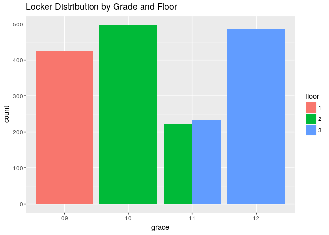
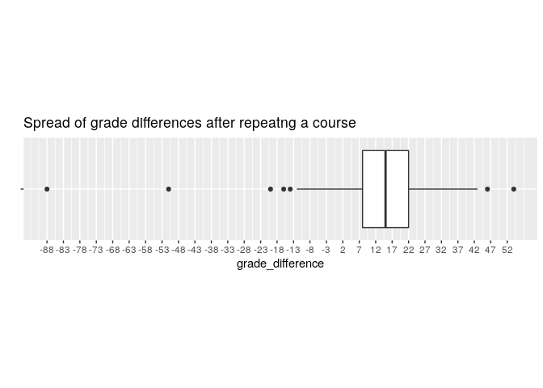
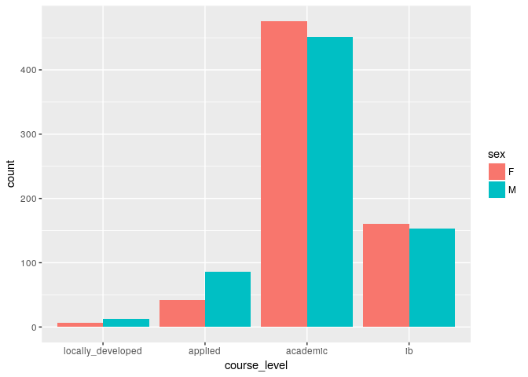

Data Cleaning
=============

The data is contained into 3 different files, each containing different information about the students. The files are delimited by pipes. Unknown columns are replaced with "x".

``` r
grades <- read_delim("data/newData_STCR.psv", delim = "|", 
                     col_names = c("id", "course_code", "date_completed",
                                   "grade", "credit", "x1", "x2", "name", "credit_full"))

students <- read_delim("data/newData_STUD.psv", delim = "|", 
                       col_names = c("id", "x1", "student_id",
                                     "x2", "first_name", "last_name", "x3", "x4", "birthday",
                                     "grade", "sex", "homeroom", "x5", "x6", "x7", "x8", "x9",
                                     "locker_num", "x10", "native_language", "status", "start_date", 
                                     "x11", "school", "x12", "medical"))
grad_reqs <- read_delim("data/newData_STAI.psv", delim = "|", 
                        col_names = c("id", "key", "value"))
```

Peeking into our data a little, it seems that our unknown columns don't give us any useful information. We'll drop these columms and the ones that are anonymized such as name.

``` r
students %>% head()
```

    ## # A tibble: 6 x 26
    ##   id     x1    student_id     x2 first_name last_name x3    x4    birthday
    ##   <chr>  <chr>      <int>  <int> <chr>      <chr>     <chr> <chr>    <int>
    ## 1 00000… <NA>   123456789 9.88e⁸ First      Last      First Last  19990301
    ## 2 00000… <NA>   123456789 9.88e⁸ First      Last      First Last  19990801
    ## 3 00000… <NA>   123456789 9.88e⁸ First      Last      First Last  19981001
    ## 4 00000… <NA>   123456789 9.88e⁸ First      Last      First Last  20000301
    ## 5 00000… <NA>   123456789 9.88e⁸ First      Last      First Last  19980901
    ## 6 00000… <NA>   123456789 9.88e⁸ First      Last      First Last  20010601
    ## # ... with 17 more variables: grade <chr>, sex <chr>, homeroom <chr>,
    ## #   x5 <chr>, x6 <chr>, x7 <chr>, x8 <chr>, x9 <chr>, locker_num <int>,
    ## #   x10 <chr>, native_language <chr>, status <chr>, start_date <int>,
    ## #   x11 <chr>, school <chr>, x12 <chr>, medical <chr>

We'll also do some more formatting.

``` r
students <- students %>%
              select(-starts_with("x"), -student_id, -first_name, -last_name, 
                      -school, -status, -native_language, -start_date) 

students$sex <- as.factor(students$sex)
students$grade <- as.factor(students$grade)
students$birthday <- as.Date(as.character(students$birthday), "%Y%m%d")
```

Now we can more easily analyze our data, for example how are lockers distributed by grade? Maybe not so surprisingly, each grade has a respective floor (except where some grade 11s and 12s can mingle).

``` r
locker_distribution <- students %>%
                          select(grade, locker_num) %>%
                          na.omit() %>%
                          mutate(floor = as.factor(floor(locker_num / 1000)))

ggplot(locker_distribution) +
  geom_bar(aes(x = grade, fill = floor), position = position_dodge()) + 
  labs(title = "Locker Distribution by Grade and Floor")
```



We spread out our data stored in the gradutation requirements to make it tidy.

``` r
grad_reqs %>% head()
```

    ## # A tibble: 6 x 3
    ##   id         key                        value        
    ##   <chr>      <chr>                      <chr>        
    ## 1 0000000568 Community Hours            0            
    ## 2 0000000568 Literacy Test Requirements Not Completed
    ## 3 0000000568 Literacy Test status       Eligible     
    ## 4 0000000568 Reading results            U            
    ## 5 0000000568 Reading results date       20150326     
    ## 6 0000000568 Writing results            U

``` r
grad_reqs <- grad_reqs %>%
  spread(key = key, value = value) %>%
  mutate(`Community Hours` = as.numeric(`Community Hours`),
         `Literacy Test Requirements` = as.factor(`Literacy Test Requirements`),
         `Literacy Test status` = as.factor(`Literacy Test status`),
         `Reading results` = as.factor(`Reading results`),
         `Reading results date` = as.Date(`Reading results date`, "%Y%m%d"),
         `Writing results` = as.factor(`Writing results`),
         `Writing results date` = as.Date(`Writing results date`, "%Y%m%d"))
grad_reqs %>% head()
```

    ## # A tibble: 6 x 8
    ##   id       `Community Hours` `Literacy Test Requireme… `Literacy Test sta…
    ##   <chr>                <dbl> <fct>                     <fct>              
    ## 1 0000000…               0   Not Completed             Eligible           
    ## 2 0000002…             158   Successfully Completed i… Eligible           
    ## 3 0000002…              36.0 Successfully Completed i… Eligible           
    ## 4 0000002…              43.0 Not Completed             Eligible           
    ## 5 0000003…              65.0 Successfully Completed i… Eligible           
    ## 6 0000003…               0   Not Completed             Eligible           
    ## # ... with 4 more variables: `Reading results` <fct>, `Reading results
    ## #   date` <date>, `Writing results` <fct>, `Writing results date` <date>

We can do similar things to grades, however there's something interesting that stands out in the `credit_full` column. There seem to be weird values such as `15.00`, `W`, `R`. The latter two seem to stand for "Withdraw" and "Repeat" respectively, as courses with `R` appear twice.

``` r
summary(as.factor(grades$credit_full))
```

    ##  0.00  0.50  1.00 13.00 14.00 15.00 16.00  2.00  3.00  4.00  6.00  7.00 
    ## 15381  2058 22823    38    19    18   550     9    19    19    19   133 
    ##  8.00   N/A     R     W  NA's 
    ##   394    20    95    10     2

``` r
grades <- grades %>%
            mutate(is_repeated = (credit_full == "R"),
                   date_completed = as.Date(as.character(date_completed), "%Y%m%d")) %>%
            select(-starts_with("x"), -credit_full)
```

Analysis
========

What seems most useful are the courses that are repeated. It seems that students who repeat courses, tend to achieve a higher mark by about 15% the second time around. It appears that a student dropped 88% after repeating a course, this seems very unlikely because it is doubtful that a student who achieved an 88+ in a course would repeat it.

``` r
repeat_differences <- grades %>%
                        arrange(date_completed) %>%
                        group_by(id, course_code) %>%
                        mutate(grade_difference = c(NA, diff(grade))) %>%
                        na.omit()
ggplot(repeat_differences) +
  geom_boxplot(aes(x = "student", y = grade_difference)) +
  coord_flip() +
  labs(title = "Spread of grade differences after repeatng a course") +
  xlab("") +
  theme(aspect.ratio = 0.2, axis.text.y = element_blank()) +
  scale_y_continuous(breaks = round(seq(min(repeat_differences$grade_difference), max(repeat_differences$grade_difference), by = 5), 1))
```



Every Ontario student must take a literacy test in grade 10, what factors might be indicative that a student will be in risk of failing the literacy test?

``` r
grades %>%
  filter(str_detect(course_code, "(ESL)|(ENG)")) %>% #  Find all English courses
  group_by(id) %>%
  mutate(is_esl = any(str_detect(course_code, "^ESL"))) %>%  # Tag those who have taken an esl course as esl
  filter(str_detect(course_code, "^ENG1")) %>%  # Find all grade 9 english courses
  filter(date_completed == max(date_completed)) %>%  # Keep only the latest grade 9 english mark
  mutate(course_level = case_when(str_detect(course_code, "^ENG1L") ~ "locally_developed", 
                                  str_detect(course_code, "^ENG1P") ~ "applied",
                                  str_detect(course_code, "^ENG1D[0-9]$") ~ "academic",
                                  str_detect(course_code, "^ENG1DB$") ~ "ib")) %>%
  mutate(course_level = factor(course_level, levels = c("locally_developed", "applied", "academic", "ib"))) %>%
  mutate(course_level = as.factor(course_level)) %>%
  rename(english_grade = grade) %>%
  select(-credit, -name, -date_completed, -course_code, -is_repeated) %>% # Remove unwanted columns
  right_join(students, ., by = "id") %>%
  left_join(grad_reqs, by = "id") %>%
  filter(grade == 11 || grade == 12) %>%
  mutate(passed_osslt = `Reading results` == "S") -> osslt_dataset
```

Now we can fit a logistic regression model:

``` r
osslt_model <- glm(passed_osslt ~ sex + english_grade + course_level + is_esl, family = binomial(link = "logit"), data = osslt_dataset, na.action = na.omit)

summary(osslt_model)
```

    ## 
    ## Call:
    ## glm(formula = passed_osslt ~ sex + english_grade + course_level + 
    ##     is_esl, family = binomial(link = "logit"), data = osslt_dataset, 
    ##     na.action = na.omit)
    ## 
    ## Deviance Residuals: 
    ##      Min        1Q    Median        3Q       Max  
    ## -2.81326   0.00005   0.10817   0.22685   1.86292  
    ## 
    ## Coefficients:
    ##                        Estimate Std. Error z value Pr(>|z|)    
    ## (Intercept)          -1.297e+01  2.073e+00  -6.257 3.92e-10 ***
    ## sexM                 -9.327e-03  3.575e-01  -0.026   0.9792    
    ## english_grade         1.501e-01  2.314e-02   6.485 8.90e-11 ***
    ## course_levelapplied   2.285e+00  9.477e-01   2.411   0.0159 *  
    ## course_levelacademic  5.664e+00  9.828e-01   5.763 8.27e-09 ***
    ## course_levelib        2.179e+01  1.158e+03   0.019   0.9850    
    ## is_eslTRUE            1.958e+01  4.981e+03   0.004   0.9969    
    ## ---
    ## Signif. codes:  0 '***' 0.001 '**' 0.01 '*' 0.05 '.' 0.1 ' ' 1
    ## 
    ## (Dispersion parameter for binomial family taken to be 1)
    ## 
    ##     Null deviance: 476.20  on 894  degrees of freedom
    ## Residual deviance: 250.24  on 888  degrees of freedom
    ##   (495 observations deleted due to missingness)
    ## AIC: 264.24
    ## 
    ## Number of Fisher Scoring iterations: 19

The model has captured that one's English mark and whether they're locally developed or academic are the most significant predictors. Astoundingly, being in academic makes you **288 times** more likely to pass. However it is important to note that this dataset comes from one school which province considers as "high performing".

*Getting data across the board/province would allow for more leverage*.

``` r
anova(osslt_model, test = "Chisq")
```

    ## Analysis of Deviance Table
    ## 
    ## Model: binomial, link: logit
    ## 
    ## Response: passed_osslt
    ## 
    ## Terms added sequentially (first to last)
    ## 
    ## 
    ##               Df Deviance Resid. Df Resid. Dev  Pr(>Chi)    
    ## NULL                            894     476.20              
    ## sex            1    6.765       893     469.43  0.009296 ** 
    ## english_grade  1   70.237       892     399.20 < 2.2e-16 ***
    ## course_level   3  145.469       889     253.73 < 2.2e-16 ***
    ## is_esl         1    3.486       888     250.24  0.061894 .  
    ## ---
    ## Signif. codes:  0 '***' 0.001 '**' 0.01 '*' 0.05 '.' 0.1 ' ' 1

While `sex` does seem to be a significant predictor, the figure below shows that the information provided is already captured by the course level. That is more males are in the levels that are more likely to struggle.

``` r
osslt_dataset %>%
  filter(!is.na(course_level)) %>%
  ggplot() +
    geom_bar(aes(x = course_level, fill = sex), position = position_dodge())
```


